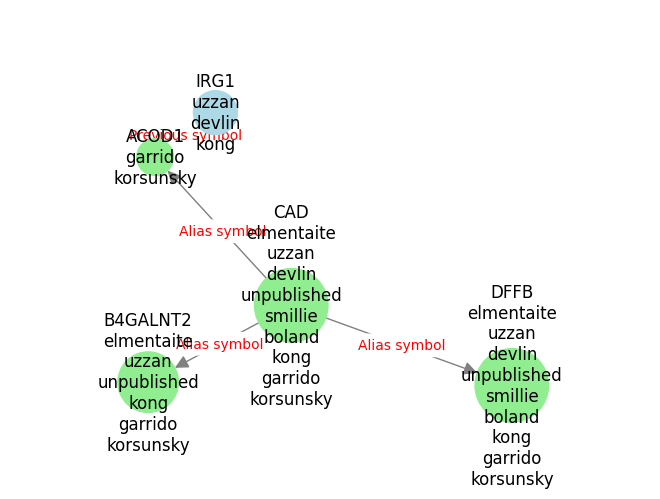
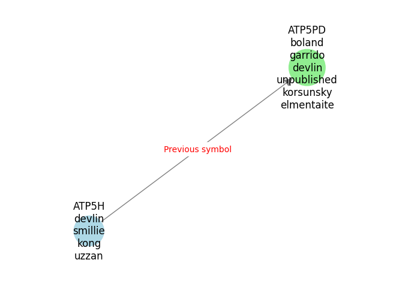
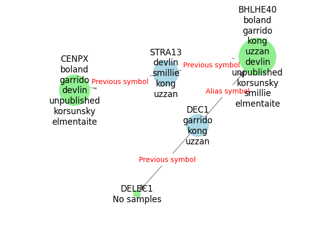

# hugo-unifier

This python package can unify gene symbols across datasets based on the [HUGO database](https://www.genenames.org/tools/multi-symbol-checker/).

## Installation

The package can be installed via pip, or any other Python package manager.

```bash
pip install hugo-unifier
```

## Usage

The package can be used both as a command line tool and as a library.
It operates in a two-step process:

1. Take the symbols from the input data and create a list of operations to unify them, including a reason for the change
2. Apply the operations to the input data

### Command Line Tool

```bash
hugo-unifier get --outdir . test1.h5ad test2.h5ad
```

This will create two files, `test1_changes.csv` and `test2_changes.csv` in the current directory.
These files can be manually inspected to see what changes will be made and what the reasons for each change are.

The command line tool can also be used to apply the changes to the input data:

```bash
hugo-unifier apply --input test1.h5ad --changes test1_changes.csv --output test1_unified.h5ad
hugo-unifier apply --input test2.h5ad --changes test2_changes.csv --output test2_unified.h5ad
```

### Library

Similar to the command line tool, the library can be used to get the changes and apply them to the input data.

```python
from hugo_unifier import get_changes, apply_changes
import anndata as ad

adata_test1 = ad.read_h5ad("test1.h5ad")
adata_test2 = ad.read_h5ad("test2.h5ad")

dataset_symbols = {
   "test1": adata_test1.var.index.tolist(),
   "test2": adata_test2.var.index.tolist(),
}

# Get the changes
G, sample_changes = get_changes(dataset_symbols)

changes_test1 = sample_changes["test1"]
changes_test2 = sample_changes["test2"]

# Apply the changes
adata_test1_unified = apply_changes(adata_test1, changes_test1)
adata_test2_unified = apply_changes(adata_test2, changes_test2)
```

## How it works

### Step 1: Get HUGO data for symbols while applying manipulations

The first step is to get the HUGO data for the symbols in the input data.
However, sometimes symbols contain artifacts like dots instead of dashes, or numbers following dots indicating a version. As these are mostly not detected in the HUGO database, we try to manipulate the symbols until the HUGO database returns a result.
The manipulations are done in the following order:

1. Keep the symbol as-is
2. Replace dots with dashes
3. Remove everything after the first dot

If one of the manipulations returns a result for a given symbol, we do not try the others for that symbol. Notably, we start with the most conservative approach, keeping the symbol as-is, and only try the other manipulations if that fails.

### Step 2: Build a symbol graph

Different symbols can sometimes have quite complex relationships.
For example, a symbol can be an alias or a previous symbol for multiple other symbols, or a symbol can have multiple aliases or previous symbols. These relationships can be nicely visualized in a graph.

An example for this is shown here:



Green nodes are approved symbols, blue ones are not.

The graph is constructed as follows:
1. Add a node for each of the following:
   - Original symbols from the input data
   - Manipulated symbols that arise within the process
   - Symbols returned by the HUGO database
2. Save the datasets that have the symbol within the node with the exact same name
3. Draw edges for the following relationships:
   - Manipulations (e.g. dot to dash)
   - HUGO relations (Alias, Previous symbol, Approved symbol)

#### Clean the graph

This includes only two steps:
1. Remove self-loops (edges from a node to itself)
2. Remove all nodes that meet the following conditions (and are thus irrelevant for the unification):
    - Node has exactly one incoming edge, that originates from an approved symbol
    - Node is an approved symbol which is not represented in the input data

### Step 3: Find unification opportunities

Currently, there are two approaches implemented. This can be easily extended in the future.

#### Resolve unapproved symbols

Iterate over all nodes in the graph that represent unapproved symbols and try to find an optimal solution for them. The optimal solution is decided as follows:

1. If the node has only one outgoing edge, the optimal solution is the target of that edge
2. If the node has multiple outgoing edges, we check if the targets of the edges are represented in any datasets. If there is exactly one target that is represented in any datasets, we use that one. If there are multiple, we mark it as a _conflict_ and do not resolve it. If there is none, we do not resolve it either.

Now we have a source and a target node. Based on this, we can check if there is any dataset that has both the symbols in the source and target node. If that is the case, we would potentially loose some information if we would eliminate the source node. 
Thus, we do the following:
- If an overlap exists (like the "Devlin" dataset in the following example), copy the symbols that are exclusive to the source node to the target node 
- If no overlap exists, we can safely remove the source node and rename all symbols from the source node to the target node 

#### Aggregate approved symbols

This tries to resolve situations where one group of datasets contains one approved symbol, while another group of datasets contains another approved symbol, while one is an alias of the other. The logic is as follows:

1. Iterate all nodes representing approved symbols
2. Get all predecessors of the node
3. Get the union of the represented datasets of all predecessors and the node itself
4. Get the maximum number of datasets that are represented by any single predecessor or the node itself
5. Calculate the improvement ratio as the union size divided by the maximum size
6. If the improvement ratio is greater than 1.5, copy the symbols from all predecessors to the node

In the example below, the STRA13 gene would be copied to CENPX for all samples that have CENPX but not STRA13. This is because the union is 9 and the largest number of datasets in a single one of the two nodes is 6 in CENPX. The improvement ratio is exactly 1.5, so the copy is done.



### Step 4: Provide change dataframe

All changes that are made to the graph are also stored in form of a dataframe, that is made available to the user for inspection. Before the dataframe is returned, it is split into smaller per-dataset dataframes.

If `hugo-unifier` is used via CLI, these dataframes are saved to the output directory. If `hugo-unifier` is used via the library, the dataframes are returned as a dictionary with the dataset names as keys and the dataframes as values.

### Step 5: Apply changes to the input data

The content of a single-dataset change dataframe is applied to the corresponding input dataset. Basically all the change entries are applied one-by-one to the input dataset, in the same order as they were detected in the graph unification process.
